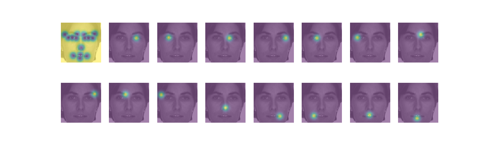

### Facial Keypoints Detection on Kaggle dataset

Testing keypoint heatmaps using Convolutional Pose Machines [arxiv.org/abs/1602.00134](https://arxiv.org/abs/1602.00134).

Data: [facial keypoints dataset](https://www.kaggle.com/c/facial-keypoints-detection/data)

Ground truth sample

Predicted heatmaps for 15 keypoints

Predicted heatmaps for 4 keypoints

Predicted heatmaps combined

Predicted heatmaps converted to keypoints

